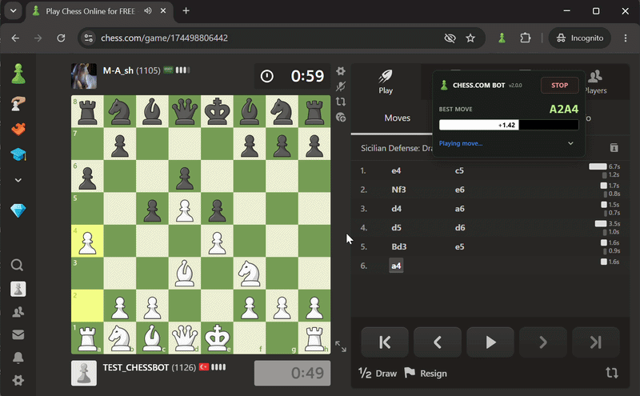

# ChessBot



ChessBot is a powerful Chrome Extension designed for **Chess.com**. It integrates advanced engine analysis directly into your browser, allowing you to observe, analyze, and learn from a top-tier chess engine in real-time.

## 🚀 Purpose & Vision

The primary goal of this extension is **education through observation**.

*   **Engine vs. Bot Matchups**: It is built to simulate matches between different engines and Chess.com's computer personalities (bots).
*   **Learning Tool**: By watching how high-level engines (like Stockfish 18) navigate complex positions against AI, players can improve their tactical awareness and positional understanding.

> [!WARNING]
> **STRICT FAIR PLAY POLICY**
> This application is strictly for educational purposes. **DO NOT use this tool to gain an unfair advantage against real human players.** Using chess bots in competitive matches against humans is a violation of Chess.com's Terms of Service and undermines the spirit of the game.

## ✨ Key Features

*   **Local Stockfish 18**: Runs entirely in your browser via WASM. There is no remote engine or API configuration, and all calculations stay on your device.
*   **Real-time Evaluation Bar**: A dynamic, responsive eval bar that shows the advantage from the current player's perspective.
*   **Auto Play Mode**: Automatically execute engine moves with a customizable random delay to simulate match flows.
*   **Auto New Match & Auto Rematch**: Detect game over and start the next game automatically, with 2.5-second delays.
*   **Mistake Mode**: In both Best Move and Average Move modes, try a safe, non-losing alternative with the configured probability when the player's advantage meets **Eval Threshold**. The threshold defaults to 2.5 pawns and is adjustable from 0 to 4 in 0.5 steps beside Mistake. At 0% mistakes are disabled; at 100% every eligible player turn triggers an attempt. If no safe alternative is found, keep the normal selection.
*   **Smooth UI**: A modern, draggable overlay panel that stays out of your way and remembers its position.
*   **Customizable Depth**: Adjust analysis depth from 1 to 30 to balance speed and power.

## 🛠️ Installation

1. Download the latest release: https://github.com/bariskisir/ChessBot/releases/latest/download/dist.zip
2. Unzip the archive.
3. Open `chrome://extensions`.
4. Enable **Developer mode**.
5. Click **Load unpacked**.
6. Select the extracted `dist` folder.

To build from source instead:

```sh
npm ci
npm run check
npm test
npm run build
```

Then load the generated `dist` directory as an unpacked extension.

## ⚙️ How to Use

1.  Navigate to any game or analysis page on [Chess.com](https://www.chess.com/play/computer).
2.  The **ChessBot** panel will appear on the screen.
3.  Click **START** to begin board detection and analysis.
4.  Toggle **AUTO PLAY** if you want the bot to make moves automatically (ideal for engine-vs-bot matches).
5.  Use the **Advanced Settings** (arrow icon) to adjust Auto New Match, Auto Rematch, average move selection, random delay, mistake probability, engine variations (MultiPV), and depth.

## 💡 Optimal Settings for Auto Features

To ensure **Auto New Match** and **Auto Rematch** functions correctly without interruptions, please disable the following features in your settings:

### Coach Settings
*   Motivational messages
*   Reminders
*   Voice
*   Puzzles
*   Show puzzle goals
*   Show mistake feedback
*   Show chat hints

### Interface Settings
*   Show Streaks
*   Collect puzzle points
*   Show post-game feedback
*   Enable Special Themes
*   Show piece icons in game notation

## ⚖️ Ethics & Responsibility

Respect the chess community. This tool is meant to be a companion for learning and bot-testing. Always maintain high standards of sportsmanship.
