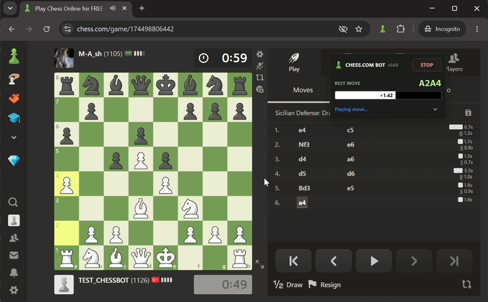

# ChessBot



ChessBot is a Chrome extension for **Chess.com** and **Lichess**. It shows local chess-engine analysis beside supported game boards, with selectable Stockfish and Lozza versions.

## 🚀 Purpose & Vision

The primary goal of this extension is **education through observation**.

*   **Engine vs. Bot Matchups**: It is built to simulate matches between different engines and Chess.com's computer personalities (bots).
*   **Learning Tool**: By watching engines of different strengths navigate complex positions against AI, players can improve their tactical awareness and positional understanding.

> [!WARNING]
> **STRICT FAIR PLAY POLICY**
> This application is strictly for educational purposes. **DO NOT use it to gain an unfair advantage against human players.** Chess.com prohibits engine assistance in competitive play. [Lichess Fair Play](https://lichess.org/page/fair-play) prohibits engine help during human games and programmatic GUI moves even against its AI; use the Lichess features only where its rules permit them.

## ✨ Key Features

*   **Local Chess Engines**: Choose Lozza 2 (default), Lozza 5, Stockfish 10, or Stockfish 19 Lite. Stockfish uses WASM and Lozza uses JavaScript workers. All calculations stay on your device, with no remote engine or API configuration.
*   **Real-time Evaluation Bar**: A dynamic, responsive eval bar that shows the advantage from the current player's perspective.
*   **Auto Play Mode**: Automatically execute engine moves with dynamic clock allocation, or a customizable random delay.
*   **Auto New Match & Auto Rematch**: Detect game over and start the next game automatically, with 2.5-second delays. On Lichess, an automated follow-up keeps the bot running after navigation to the new round.
*   **Mistake Mode**: With the configured probability, play the weakest engine alternative that still keeps your advantage above **KEEP EVAL**. Keep defaults to 2 pawns and is adjustable from 0 to 5 in 0.5 steps beside Mistake. At 0% mistakes are disabled. If no alternative stays above the floor, or you are already below it, keep the normal selection.
*   **Smooth UI**: A modern, draggable overlay panel that stays out of your way and remembers its position.
*   **Customizable Depth**: Adjust analysis depth from 1 to 30 to balance speed and power.

## 🛠️ Installation

1. Download the latest release: https://github.com/bariskisir/ChessBot/releases/latest/download/dist.zip
2. Unzip the archive.
3. Open `chrome://extensions`.
4. Enable **Developer mode**.
5. Click **Load unpacked**.
6. Select the extracted `dist` folder.

To build from source instead:

```sh
npm ci
npm run check
npm test
npm run build
```

Then load the generated `dist` directory as an unpacked extension.

Install and build hooks copy the pinned `stockfish@19.0.0` single-threaded Lite worker and `stockfish@10.0.2` WASM build (npm alias `stockfish-10`) into `public/vendor`. Stockfish 10 has no separate Lite edition; its worker and binary total about 430 KB. Change the pinned package versions rather than editing generated assets.

Lozza's unmodified JavaScript sources are bundled from [Lozza 2.0](https://github.com/namanthanki/lozza/tree/3c222b28b76e0e3dc3e5fa417e8aae15642dc114) and [Lozza 5](https://github.com/namanthanki/lozza/tree/3ef2967740e7e1103078531b8b83eb49ceff3b2a). The adapter supplies MultiPV, UCI coordinate moves, and normalized mate scores. STOP terminates synchronous Lozza searches immediately. Stockfish retains its warm worker after a completed search or successful cancellation; switching engines replaces the worker after the current owner's cancellation settles.

The engine menu is sorted by increasing reference rating: Lozza 2 **2554**, Lozza 5 **3071**, Stockfish 10 **3447**, Stockfish 19 Lite **3792**. Lozza and Stockfish 19 use [CCRL Blitz](https://computerchess.org.uk/404/rating_list_all.html); Stockfish 10 uses its [CCRL 40/15 reference from 2024-11-16](https://www.computerchess.org/cgi/engine_details.cgi?eng=Stockfish+10+64-bit&print=Details+%28text%29). Stockfish 19 Lite displays the full engine's rating as a reference. These are different rating pools and are not measured browser ratings; depth, time and the Lite network affect actual playing strength.

Stockfish and these pinned Lozza sources are GPL-3.0; their upstream license texts are included with the vendor assets. ChessBot application code is MIT.

## ⚙️ How to Use

1.  Navigate to a game on [Chess.com](https://www.chess.com/play/computer), a standard round on [Lichess](https://lichess.org/), or [Lichess training](https://lichess.org/training). The Lichess adapter reads the visible Chessground board and move list.
2.  The **ChessBot** panel will appear on the screen.
3.  Click **START** to begin board detection and analysis.
4.  Toggle **AUTO PLAY** if you want the bot to make moves automatically (ideal for engine-vs-bot matches).
5.  Open **Advanced Settings** (arrow icon). Select the engine above **AUTO PLAY**, then adjust Dynamic Delay, Auto New Match, Auto Rematch, average move selection, mistake probability, engine variations (MultiPV), and depth. The engine choice is saved and changing it cancels pending work before recalculating.

Stockfish verifies average and mistake evaluations at a minimum depth of 15. Lozza verifies at the selected depth so a low-depth search does not silently become a much longer depth-15 search. A proved mate or a sole legal move can finish before the requested depth.

**DYNAMIC DELAY** defaults on beside **AUTO PLAY**. It distributes the remaining match time over an initial 40-move forecast, includes future increments, and extends the forecast as long games develop. Board settling, queued analysis, deep evaluation, and alternative searches share the same turn budget. Time trouble removes intentional waiting and bounds analysis to preserve time for input. Untimed games and training add no dynamic wait. Turn Dynamic Delay off to reveal **RANDOM DELAY** on the next row; its saved maximum remains available and elapsed analysis is deducted from the random target. When a site's time control is unavailable, allocation uses its visible remaining clock conservatively without assuming an increment.

Lichess Auto Play uses Chrome's `debugger` permission because Chessground ignores synthetic mouse events. Chrome will show a debugging notice while each move is sent. Training puzzles require a visible move history so the current position can be reconstructed. When Lichess rounds hide their move list, position reading follows legal moves from an observed starting board. Unsupported variants and a midgame reload without visible history remain unanalyzed.

Puzzle Racer and Puzzle Storm read the visible board, last-move markers, and legal continuations. A new timed puzzle has no visible history, so its initial FEN omits unknown castling and en passant rights; positions requiring those rights may have incomplete suggestions.

Unaccepted or stalled move input retries up to three times with a one-second wait and fresh analysis using the current Average/Mistake settings. Each input attempt has a three-second limit. STOP cancels pending analysis, delays, and trusted gestures.

In Lichess training, Auto Play opens the solution only after a failed move and then continues to the next puzzle. Correct intermediate moves keep the puzzle in progress.

## 💡 Optimal Settings for Auto Features

To ensure **Auto New Match** and **Auto Rematch** functions correctly without interruptions, please disable the following features in your settings:

### Coach Settings
*   Motivational messages
*   Reminders
*   Voice
*   Puzzles
*   Show puzzle goals
*   Show mistake feedback
*   Show chat hints

### Interface Settings
*   Show Streaks
*   Collect puzzle points
*   Show post-game feedback
*   Enable Special Themes
*   Show piece icons in game notation

## ⚖️ Ethics & Responsibility

Respect the chess community. This tool is meant to be a companion for learning and bot-testing. Always maintain high standards of sportsmanship.
